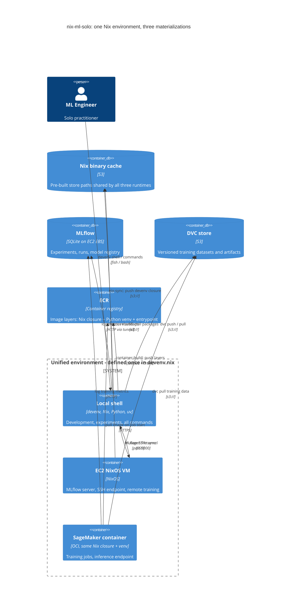

# Architecture

## One environment, three materializations

The central idea in nix-ml-solo is that `devenv.nix` defines a single Nix environment that is materialized in three places simultaneously — your laptop, the EC2 VM, and the SageMaker container. Four sync channels keep them consistent:

| Channel | Syncs | Mechanism |
|---|---|---|
| **Files** | laptop ↔ EC2 | mutagen bidirectional sync over SSH |
| **Packages** | laptop → S3 → EC2 / SageMaker | Nix binary cache in S3 |
| **Experiments** | SageMaker → EC2 ← laptop | MLflow server on EC2, SSH tunnel locally |
| **Data** | laptop ↔ S3 ↔ SageMaker | DVC remote on S3 |

This eliminates the "works on my machine" problem for ML: if your training script runs locally, it runs on SageMaker, because the Nix closure that produced the environment is bit-for-bit identical.

## C4 Container diagram

## Why this works

### Nix makes the environment portable

The devenv shell, the NixOS EC2 image, and the SageMaker container are all built from the same `devenv.lock`. Nix computes a content-addressed hash for each package; the same hash always produces the same binary. There are no version strings or floating tags — the lock file is the environment.

### The Nix binary cache eliminates redundant builds

When you update `devenv.nix` and run `direnv reload`, Nix builds the new packages locally. `nix-sync` pushes the resulting store paths to S3. When EC2 runs `nixos-rebuild`, it pulls pre-built paths from S3 instead of compiling from source. The SageMaker container layers are also stamped by the devenv profile hash — unchanged layers are reused directly from ECR.

### mutagen replaces a shared filesystem

EC2 sees your project files as if they were local because mutagen syncs them in real time over SSH. This means you can edit locally and run `train-on-ec2` without an explicit `rsync` step, and output files written on EC2 appear locally immediately.

### MLflow on EC2 with an SSH tunnel

MLflow runs as a service on EC2. `mlflow-open` creates a local SSH tunnel on port 5000, so `MLFLOW_TRACKING_URI=http://localhost:5000` works the same whether the code is running locally or inside a SageMaker job. There is no public MLflow port — the tunnel is the only entry point.
